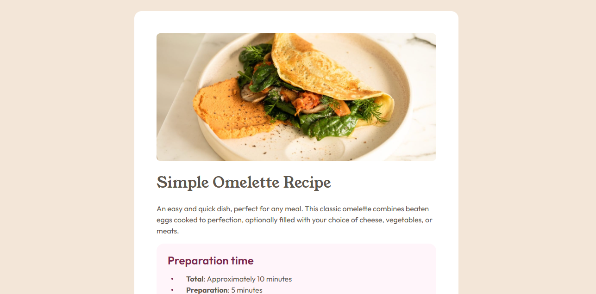

# Frontend Mentor - Recipe page solution

This is a solution to the [Recipe page challenge on Frontend Mentor](https://www.frontendmentor.io/challenges/recipe-page-KiTsR8QQKm). Frontend Mentor challenges help you improve your coding skills by building realistic projects.

## Table of contents

-   [Overview](#overview)
    -   [The challenge](#the-challenge)
    -   [Screenshot](#screenshot)
    -   [Links](#links)
-   [My process](#my-process)
    -   [Built with](#built-with)
    -   [What I learned](#what-i-learned)
-   [Author](#author)
-   [Acknowledgments](#acknowledgments)

**Note: Delete this note and update the table of contents based on what sections you keep.**

## Overview

### Screenshot



### Links

-   Solution URL: [Add solution URL here](https://your-solution-url.com)
-   Live Site URL: [Add live site URL here](https://recipe-page-dylan.netlify.app)

## My process

### Built with

-   Semantic HTML5 markup
-   CSS custom properties
-   Flexbox
-   Mobile-first workflow

### What I learned

This was an actual _interesting_ project for me. Although this seemed like a simple easy project, there are alot of small fundamentals learning points you can have from this. Some include using the `::before` psuedo element to create your own custom bullet point and using flexbox to center align it, key semantic html layout and a better grasp of mobile first development.

```html
<section class="prep--container">
    <h2>Preparation time</h2>
    <ul>
        <li>
            <div>
                <b>Total</b>:
                <time datetime="PT10M">Approximately 10 minutes</time>
            </div>
        </li>
        <li>
            <div>
                <b>Preparation</b>:
                <time datetime="PT5M">5 minutes</time>
            </div>
        </li>
        <li>
            <div>
                <b>Cooking</b>:
                <time datetime="PT5M">5 minutes</time>
            </div>
        </li>
    </ul>
</section>
```

```css
ul li {
    list-style: none;
    position: relative;
    display: flex;
    align-items: center;
    line-height: 1.5;
    &::before {
        display: block;
        content: "";
        width: 0.25rem;
        height: 0.25rem;
        background-color: var(--rose-800);
        border-radius: 50%;
        position: absolute;
        left: -2rem;
    }
}
```

## Helpful Resources

This helped me how to vertically align the marker in respect to the `<li></li>` element.
[Align A List Item Marker Vertically](https://stackoverflow.com/questions/69874236/how-can-i-vertically-align-a-list-item-marker)

## Author

-   Website - [LinkedIn](https://linkedin.com/heslopd23)
-   Frontend Mentor - [@dylan-dot-c](https://www.frontendmentor.io/profile/dylan-dot-c)

## Acknowledgments

God is good, and I'm greateful that he loves a someone who was a sinner such as myself. We should all strive and do his will. I feel am unworthy of his love and his grace but at the end of the day these is nothing I can do to deserve it. Not because I don't deserve it but because he gave it to us as a free gift.
